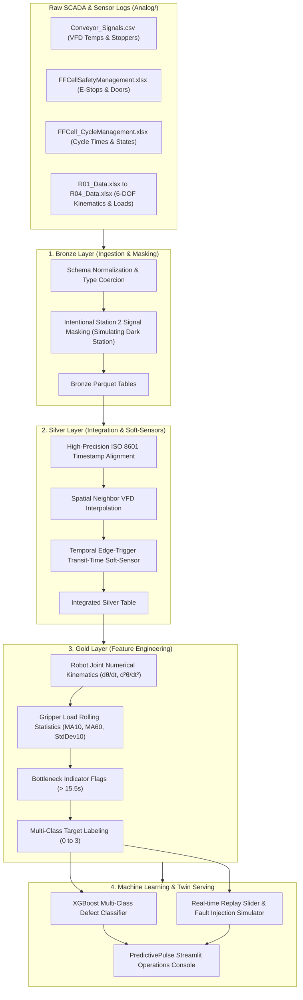

# PredictivePulse ⚡
### Real-Time Operations Digital Twin & Multi-Causal Fault Diagnostics for Assembly Lines

[-00ffcc?style=for-the-badge&logo=accenture)](https://www.accenture.com/)
[-66fcf1?style=for-the-badge)](https://www.iitism.ac.in/)
[](https://www.python.org/)
[](https://streamlit.io/)
[](https://spark.apache.org/)
[](https://xgboost.readthedocs.io/)

**PredictivePulse** is a high-fidelity industrial operations digital twin and real-time fault diagnostics platform engineered for discrete vehicle assembly lines. It integrates SCADA sensor streams, safety PLC logs, cycle times, and 6-DOF robotic manipulator telemetry into a unified reactive intelligence hub.

PredictivePulse specifically solves the **"Dark Station"** dilemma—reconstructing missing sensor telemetry on legacy, unmonitored line stations using physics-informed and temporal **Soft-Sensors** without requiring costly hardware or PLC retrofits.

---

## 📑 Table of Contents
1. [Core Features & Capabilities](#-core-features--capabilities)
2. [End-to-End System Architecture](#-end-to-end-system-architecture)
3. [The "Dark Station" Challenge & Soft-Sensor Engine](#-the-dark-station-challenge--soft-sensor-engine)
4. [Mathematical Modeling & KPIs](#-mathematical-modeling--kpis)
5. [Interactive Application Walkthrough (How to Use the App)](#-interactive-application-walkthrough-how-to-use-the-app)
   - [Sidebar Simulation Controller](#1-sidebar-simulation-controller)
   - [Console View 1: Floor Operations & Real-Time Diagnostics](#2-console-view-1-floor-operations--real-time-diagnostics)
   - [Console View 2: Plant Management & ESG Decarbonization](#3-console-view-2-plant-management--esg-decarbonization)
6. [Operational Decision Matrix (Supervisor Playbook)](#-operational-decision-matrix-supervisor-playbook)
7. [Repository Structure](#-repository-structure)
8. [Installation & Quickstart Guide](#-installation--quickstart-guide)

---

## 🌟 Core Features & Capabilities

- 🔄 **Real-Time Digital Twin Schematic**: Live visualization of Stations 1 through 5 with dynamic Stopper statuses (Holding vs. Release), motor thermal profiles, and health indices.
- 📡 **Zero-Hardware Soft-Sensors**: Spatially and temporally infers unmonitored legacy station variables (e.g., Station 2 Stopper transit time and VFD 2 temperature).
- 🤖 **6-DOF Robotic Kinematics & Vibration Diagnostics**: Computes 1st and 2nd numerical derivatives (angular velocity and acceleration) across 6 joints ($B, L, R, S, T, U$) for four assembly robots ($R01$ to $R04$) along with gripper load standard deviation vibration proxies.
- 🎯 **Multi-Class Defect Prediction**: Deploys an XGBoost gradient boosting classifier trained on gold-layer telemetry to classify chassis defects in real-time.
- ⏱️ **Dynamic OEE Computation**: Real-time evaluation of **Availability**, **Performance**, and **Quality (First Pass Yield)**.
- 🔮 **LSTM Multi-Step Bottleneck Lookahead**: Forecasts conveyor transit delays 15 cycles ahead to alert supervisors before micro-stoppages cascade into line blockages.
- 🌿 **Dynamic ESG & Decarbonization Analytics**: Tracks energy savings from dynamic VFD modulation against legacy fixed-speed motors ($15\text{ kW}$ baseline) and calculates avoided embodied carbon from early scrap diversion using the Central Electricity Authority (CEA) Indian Grid Factor ($0.82\text{ kg CO}_2\text{e/kWh}$).
- 🧪 **Interactive SCADA Fault Injector**: Allows operators and engineers to simulate active thermal runaway, stopper feed jams, robot kinematic stalls, and gripper overloads.

---

## 🛠️ End-to-End System Architecture

PredictivePulse is built on a high-throughput **Medallion Data Architecture (Bronze $\rightarrow$ Silver $\rightarrow$ Gold)** with dual execution engines (**PySpark** for distributed processing and **Pandas/NumPy** for local lightweight environments):



### Layer Breakdown
- **Bronze Layer (`data/bronze/`)**: Ingests multi-source telemetry from 7 files. Intentionally masks `I_Stopper2_Status` and `Q_VFD2_Temperature` to simulate a legacy uninstrumented assembly stage.
- **Silver Layer (`data/silver/`)**: Performs timestamp normalization and multi-stream synchronization. Reconstructs missing variables via spatial and temporal soft-sensor mathematical operators.
- **Gold Layer (`data/gold/`)**: Engineers domain-specific features including 1st and 2nd derivatives of robot joint angles, rolling gripper vibration metrics, bottleneck flags, and defect labels.
- **Serving & Inference**: XGBoost classifier outputs defect probabilities for every time-step, which are rendered via Streamlit's dark glassmorphism dashboard.

---

## 📡 The "Dark Station" Challenge & Soft-Sensor Engine

In brownfield manufacturing plants, retrofitting legacy assembly stations (like **Station 2**) with modern PLCs and IoT sensors causes costly downtime. PredictivePulse overcomes this with two soft-sensor estimators:

```
[ Station 1 ] --------> [ Station 2 (DARK) ] --------> [ Station 3 ]
  VFD 1 Temp               VFD 2 (Interpolated)           VFD 3 Temp
  Stopper 1 Release (t1)   (No Direct Sensors)            Stopper 3 Receipt (t2)
```

### 1. Spatial Thermal Soft-Sensor ($\text{VFD } 2$)
Because Conveyor Segment 2 operates in the same ambient thermal envelope between Segments 1 and 3, its motor temperature is estimated via spatial interpolation of adjacent drives:

$$\text{VFD 2 Temp (Estimated)} = \frac{\text{VFD 1 Temp} + \text{VFD 3 Temp}}{2}$$

### 2. Temporal Transit-Time Soft-Sensor ($\text{Stopper } 2$)
Transit time through Station 2 is inferred by detecting the state transition edge when Stopper 1 releases the carrier ($1 \rightarrow 0$) and when Stopper 3 confirms receipt ($0 \rightarrow 1$):

$$\Delta t_{\text{transit}} = t_{\text{receipt}}(\text{Stopper 3}) - t_{\text{release}}(\text{Stopper 1})$$

- **Baseline Transit Time**: $\approx 12.5\text{ seconds}$
- **Bottleneck Threshold**: If $\Delta t_{\text{transit}} > 15.5\text{ seconds}$ ($\ge 20\%$ delay), Station 2 is automatically flagged as an active bottleneck (`is_bottleneck = 1`).

---

## 📊 Mathematical Modeling & KPIs

### 1. Overall Equipment Effectiveness (OEE)
OEE evaluates holistic line efficiency across three fundamental pillars:

$$\text{OEE} = \text{Availability} \times \text{Performance} \times \text{Quality}$$

- **Availability**: Evaluates planned production uptime vs. downtime events (E-stops and safety door trips):
  $$\text{Availability} = \frac{\text{Total Time} - \text{Total Downtime}}{\text{Total Time}}$$
  $$\text{Downtime Criteria: } (I\_\text{HMI\_EStop\_Status} == 0) \lor (I\_\text{SafetyDoor1\_Status} == 0) \lor (I\_\text{SafetyDoor2\_Status} == 0)$$

- **Performance**: Ratio of actual throughput speed to the standard design cycle speed ($300.0\text{ seconds}$ design cycle per batch):
  $$\text{Performance} = \min\left(1.0, \max\left(0.0, \frac{\text{Standard Cycle Time } (300\text{s}) \times \text{Total Cycles}}{\text{Operating Time (seconds)}}\right)\right)$$

- **Quality (First Pass Yield)**: Proportion of cycles completed without chassis or assembly structural defects:
  $$\text{Quality} = \frac{\text{Total Cycles} - \text{Defect Cycles}}{\text{Total Cycles}}$$
  $$\text{where Defect Cycles } = \text{Unique Cycles with } \text{defect\_label} > 0$$

---

### 2. Dynamic Equipment Health Scores ($0 - 100\%$)

#### Variable Frequency Drive (VFD) Health Index
Motors suffer accelerated insulation wear above $72^\circ\text{C}$:
$$\text{Thermal Penalty} = \max\left(0.0, (\text{Temperature} - 72.0) \times 5.0\right)$$
$$\text{VFD Health (\%)} = \max\left(0.0, 100.0 - \text{Thermal Penalty}\right)$$

#### Robot Manipulator Health Index ($R01 - R04$)
Assesses pneumatic gripper overloads ($> 1500\text{ N}$) and excessive mechanical vibrations ($\sigma_{\text{load}} > 120\text{ N}$ over a 10-step rolling window):
$$\text{Load Penalty} = \max\left(0.0, \frac{\text{Gripper Load} - 1500}{30.0}\right)$$
$$\text{Vibration Penalty} = \max\left(0.0, \frac{\text{Gripper Load StdDev}_{10} - 120}{2.0}\right)$$
$$\text{Robot Health (\%)} = \max\left(0.0, 100.0 - \max(\text{Load Penalty}, \text{Vibration Penalty})\right)$$

---

### 3. Dynamic ESG Decarbonization & Circular Economy Offsets

#### VFD Dynamic Energy Modulation vs. Fixed Motors
Calculates instantaneous power draw for each VFD drive vs. a legacy $15\text{ kW}$ constant-speed motor ($60\text{ kW}$ total baseline):
$$\text{Power Draw}(\text{VFD}_i) = 8.5\text{ kW} + \max(0.0, \text{Temp}_i - 60.0) \times 0.1\text{ kW}$$
$$\text{Power Saved (kW)} = 60.0\text{ kW} - \sum_{i=1}^{4} \text{Power Draw}(\text{VFD}_i)$$
$$\text{Cumulative Energy Saved (kWh)} = \frac{\sum (\text{Power Saved}_t \times \Delta t)}{3600}$$
$$\text{Scope 2 Carbon Offset} = \text{Energy Saved (kWh)} \times 0.82\text{ kg CO}_2\text{e/kWh (CEA Indian Grid Factor)}$$

#### Avoided Material Scrap Carbon
Early defect detection halts defective assemblies at Station 2 before high-value downstream processes:
$$\text{Avoided Scrap Carbon} = \text{Defect Cycles} \times 2.5\text{ kg CO}_2\text{e/unit}$$
$$\text{Raw Material Preserved} = \text{Defect Cycles} \times 4.2\text{ lbs steel/composite}$$

---

## 🖥️ Interactive Application Walkthrough (How to Use the App)

PredictivePulse provides an intuitive, dark-mode glassmorphic interface divided into two specialized operating consoles.

---

### 1. Sidebar Simulation Controller

Located in the left sidebar, this panel puts real-time control in the user's hands:

```
+-------------------------------------------------------------+
| ⚡ PredictivePulse (Operations Digital Twin System)          |
+-------------------------------------------------------------+
| View Access Mode:                                           |
|   (*) Floor Operations Console (Real-time Diagnostics)      |
|   ( ) Plant Management & ESG Analytics Dashboard            |
|                                                             |
| SCADA Live Feed Simulator:                                  |
|   Time-Series Replay Index: [=======|=========] (Step 245)  |
|                                                             |
| Simulate Active Fault States:                               |
|   [ Baseline Operations (Normal)                         v] |
|   - Thermal Deviation (VFD 1)                               |
|   - Chassis Feed Transit Delay (Stopper 2)                  |
|   - Kinematic Fault State (Robot R04)                       |
|   - Mechanical Gripper Overload (Robot R03)                 |
+-------------------------------------------------------------+
```

1. **View Access Mode**: Switch seamlessly between real-time shop floor telemetry and plant-level executive ESG analytics.
2. **Time-Series Replay Index Slider**: Scrub back and forth across the entire production shift to observe how telemetry, OEE, and health metrics evolved over time.
3. **Simulate Active Fault States**: Inject synthetic fault scenarios on the fly to test how the digital twin and soft-sensors respond to anomalies in real-time.

---

### 2. Console View 1: Floor Operations & Real-Time Diagnostics

Designed for line supervisors, maintenance technicians, and automation engineers.

```
+---------------------------------------------------------------------------------------------------+
| PREDICTIVEPULSE OPERATIONS PORTAL - Live Assembly Line Digital Twin                               |
+---------------------------------------------------------------------------------------------------+
|  [ Station 1 ]     [ Station 2 (Dark) ]     [ Station 3 ]        [ Station 4 ]      [ Station 5 ] |
|  Stopper: Holding   Stopper: Inferred        Stopper: Release     Stopper: Holding   Inspection:  |
|  Temp: 68.4°C       Temp (Est): 69.1°C       Temp: 69.8°C         Temp: 70.2°C       Active       |
|  Health: 100%       Health (Est): 100%       Health: 100%         Health: 100%       Output: Good |
+---------------------------------------------------------------------------------------------------+
| CLASSIFICATION & PREDICTION               | SOFT-SENSOR RECONSTRUCTIONS (DARK STATION 2)          |
|                                           |                                                       |
| ✅ NORMAL OPERATION                       | Inferred Transit Time: 12.4s (Flow Normal)            |
| No defect detected in current assembly.   | Reconstructed VFD 2 Temp: 69.1°C                      |
|                                           |                                                       |
| XGBoost Probability Distribution:         | Dynamic Historical Profile (Last 50 Samples):         |
|  Normal                [============== 98%]|  --- VFD 1 (Observed)                                 |
|  Missing Nose          [= 1%              ]|  --- VFD 2 (Interpolated Soft-Sensor)                 |
|  Missing Nose & Body 2 [= 0.5%            ]|  --- VFD 3 (Observed)                                 |
|  Critical Structural   [= 0.5%            ]|  [ Interactive Plotly Temperature Trend Chart ]       |
+---------------------------------------------------------------------------------------------------+
| ROBOTIC KINEMATICS & GRIPPER HEALTH (CELL ROBOTS R01 - R04)                                       |
|                                                                                                   |
|  [ Robot R01 - 100% ]   [ Robot R02 - 100% ]   [ Robot R03 - 94% ]    [ Robot R04 - 100% ]        |
|  Load: 1210 N           Load: 1195 N           Load: 1680 N           Load: 1205 N                |
|  Vibration: 42.1 N      Vibration: 38.5 N      Vibration: 115.2 N     Vibration: 40.8 N           |
|  S-Joint Kinematics:    S-Joint Kinematics:    S-Joint Kinematics:    S-Joint Kinematics:         |
|   Angle: -45.2°          Angle: -12.4°          Angle: +32.1°          Angle: +88.5°              |
|   Velocity: 1.4°/s       Velocity: 0.8°/s       Velocity: 3.2°/s       Velocity: 0.0°/s           |
|   Accel: 0.2°/s²         Accel: 0.1°/s²         Accel: 0.9°/s²         Accel: 0.0°/s²             |
+---------------------------------------------------------------------------------------------------+
```

#### What You Can Do Here:
- **Monitor the Schematic**: Observe stopper holding states and thermal indices across all 5 stations. Notice Station 2's highlighted dashed card reflecting soft-sensor estimates.
- **Inspect Defect Predictions**: View real-time output from the XGBoost classifier, complete with actionable routing advice (e.g., *Divert to Station 5 inspection bay*).
- **Dark Station Deep Dive**: Compare observed VFD 1 and VFD 3 temperatures against the reconstructed VFD 2 temperature on a live 50-sample Plotly line chart.
- **Evaluate Robot Health**: Check each robot's gripper load, vibration standard deviation, and full 6-DOF S-Joint kinematic breakdown (angle in degrees, velocity in $^\circ/\text{s}$, acceleration in $^\circ/\text{s}^2$).

---

### 3. Console View 2: Plant Management & ESG Decarbonization

Designed for plant managers, operations executives, and ESG sustainability officers.

```
+---------------------------------------------------------------------------------------------------+
| EXECUTIVE PRODUCTION OVERVIEW                                                                     |
|  [ TOTAL CYCLES: 142 ]   [ AVG CYCLE TIME: 12.48s ]   [ STATUS: ✅ RUNNING ]   [ DEFECTS: 3 ]     |
+---------------------------------------------------------------------------------------------------+
| OVERALL EQUIPMENT EFFECTIVENESS (OEE) REAL-TIME DIALS                                             |
|                                                                                                   |
|    (( 94.2% ))             (( 98.1% ))             (( 98.2% ))             (( 97.9% ))            |
|     OEE Score              Availability            Performance            Quality (FPY)           |
+---------------------------------------------------------------------------------------------------+
| STATION 2 BOTTLENECK FORECASTING (LSTM LOOKAHEAD) | DOWNTIME ROOT CAUSE BREAKDOWN                 |
|                                                   |                                               |
|  Transit Time (s)                                 |  [ Donut Chart: Uptime vs Downtime ]          |
|  20 |                                             |  - Operating Uptime: 98.1%                    |
|  16 |------------------ Critical (15.5s)          |  - E-Stop Downtime: 1.2%                      |
|  12 | ~~~ Actual  - - - LSTM Forecast (Next 15)   |  - Safety Door 1: 0.7%                        |
|   8 +-----------------------------------------    |  - Safety Door 2: 0.0%                        |
+---------------------------------------------------------------------------------------------------+
| ESG SUSTAINABILITY & DECARBONIZATION ANALYTICS                                                    |
|                                                                                                   |
|  [ ⚡ VFD Dynamic Energy Savings ]  [ ♻️ Circular Manufacturing ]   [ 🌍 Total CO2 Offsets ]       |
|  Power Draw: 35.2 kW (-24.8 kW)    Scrap Avoided: 3 units          Total GHG Saved: 48.6 kg CO2e  |
|  Energy Saved: 49.8 kWh            Metal Saved: 12.6 lbs           [ Donut Chart:                 |
|  GHG Offset: 40.8 kg CO2e          Embodied Carbon: 7.5 kg CO2e      VFD Savings vs Scrap Avoided]|
+---------------------------------------------------------------------------------------------------+
```

#### What You Can Do Here:
- **Track Executive KPIs**: Monitor total cycle count, average cycle time against the $12.50\text{s}$ design target, active line status, and first-pass yield percentage.
- **Analyze OEE Gauges**: Inspect real-time gauge dials for Overall Equipment Effectiveness, Availability, Performance, and Quality.
- **Anticipate Bottlenecks**: Review the 15-cycle multi-step LSTM lookahead forecast to identify emerging conveyor slowdowns before they cross the $15.5\text{s}$ threshold.
- **Root-Cause Downtime**: Inspect the interactive donut chart breaking down operating uptime vs. safety door and emergency stop events.
- **Quantify ESG Offsets**: Review real-time kilowatt reductions, cumulative energy saved in kWh, avoided material scrap in lbs, and total Scope 2 greenhouse gas reductions in $\text{kg CO}_2\text{e}$.

---

## 💡 Operational Decision Matrix (Supervisor Playbook)

| Alert Trigger | Diagnostic Finding | Immediate Operational Mitigation |
| :--- | :--- | :--- |
| **Availability $< 90\%$** | High downtime caused by frequent E-Stop hits or open safety interlocks. | Audit operator movement patterns around Door 1/2; check for misaligned door limit switches. |
| **Performance $< 85\%$** | Conveyor Segment 2 cycle transit times exceeding $15.5\text{s}$. | Inspect Station 2 idler rollers for mechanical drag, check chain tension, and verify motor VFD torque. |
| **Quality (FPY) $< 98\%$** | XGBoost model flagging multiple consecutive chassis defect states. | Inspect upstream part loading feeder; calibrate vision sensor on nose-cone assembly fixture. |
| **Robot Health $< 60\%$** | Gripper load standard deviation $> 120\text{ N}$ (vibration warning) or load $> 1500\text{ N}$. | Inspect pneumatic gripper seals, check for air line pressure drops, and re-grease wrist bearings. |
| **VFD Health $< 50\%$** | Drive motor temperature exceeding $82^\circ\text{C}$. | Clean VFD cooling cabinet air filters, verify exhaust fan RPM, and check motor ventilation shroud. |

---

## 📂 Repository Structure

```text
accenture_innovation_challenge/
├── .streamlit/
│   └── config.toml                  # Premium dark-mode theme configuration
├── Analog/                          # Raw SCADA datasets (telemetry, safety, robots)
│   ├── Conveyor_Signals.csv         # VFD temperatures, stopper statuses, tray states
│   ├── FFCellSafetyManagement.xlsx  # Safety Door 1 & 2, HMI E-stop status
│   ├── FFCell_CycleManagement.xlsx  # Cycle count, cycle state, part descriptions
│   ├── R01_Data.xlsx                # Robot 1 6-DOF joint angles & gripper load
│   ├── R02_Data.xlsx                # Robot 2 6-DOF joint angles & gripper load
│   ├── R03_Data.xlsx                # Robot 3 6-DOF joint angles & gripper load
│   └── R04_Data.xlsx                # Robot 4 6-DOF joint angles & gripper load
├── data/                            # Medallion data pipeline storage
│   ├── bronze/                      # Ingested raw tables with Station 2 masking
│   ├── silver/                      # Cleaned, joined, soft-sensor reconstructed tables
│   └── gold/                        # Feature-engineered parquet dataset (features.parquet)
├── models/                          # Serialized machine learning artifacts
│   ├── xgboost_defect_model.pkl     # Trained XGBoost 4-class classifier
│   └── feature_cols.pkl             # Feature column names for inference
├── app.py                           # Streamlit Digital Twin application & UI portal
├── etl_pipeline.py                  # Medallion ETL & ML training pipeline (Spark + Pandas)
├── requirements.txt                 # Project Python dependencies
└── README.md                        # Documentation & application guide
```

---

## 🚀 Installation & Quickstart Guide

### Prerequisites
- Python `3.10` or higher (`Python 3.11+` recommended)
- 4 GB+ RAM for local data processing

### 1. Clone & Setup Environment
```bash
# Clone the repository
git clone https://github.com/<your-repo>/accenture_innovation_challenge.git
cd accenture_innovation_challenge

# Create and activate a virtual environment
python -m venv venv

# On Windows:
.\venv\Scripts\activate

# On macOS/Linux:
source venv/bin/activate

# Install dependencies
pip install -r requirements.txt
```

### 2. Execute the Medallion ETL Pipeline
Run the data pipeline to ingest the raw logs in `Analog/`, apply soft-sensor reconstructions, engineer kinematic features, and train the XGBoost classifier:
```bash
python etl_pipeline.py
```
*(Note: If PySpark is not configured on your machine, the pipeline automatically detects your environment and runs the built-in high-performance Pandas/NumPy engine).*

### 3. Launch the PredictivePulse Operations Console
Start the Streamlit web application:
```bash
python -m streamlit run app.py
```

Open your browser and navigate to:
```
http://localhost:8501
```

---

## 👥 Project Team & Acknowledgments

- **Team**: Rahul & Team
- **Institution**: Indian Institute of Technology (Indian School of Mines), Dhanbad
- **Event**: Accenture Innovation Challenge 2026
- **Track**: Problem Track 4 — *DigitalTwin.ai*
