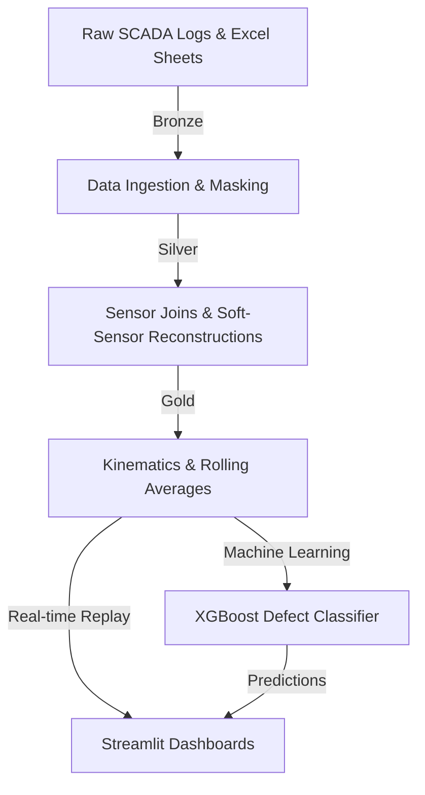

# PredictivePulse ⚡
### Real-Time Operations Digital Twin & Fault Diagnostics for Assembly Lines

Hey there! This is our team's project for the **Accenture Innovation Challenge 2026 - Problem Track 4 (DigitalTwin.ai)**. We built an operations digital twin of a vehicle assembly line that flags bottlenecks, predicts assembly defects in real-time, and calculates ESG/carbon offsets dynamically based on PLC sensor streams.

---

## 🛠️ How it Works (Our Architecture)

We set up a Medallion-style data pipeline (Bronze -> Silver -> Gold) to process the raw sensor data, train an XGBoost classifier, and display everything on a Streamlit operations console:



- **Bronze Layer**: We load the raw conveyor logs, safety door logs, cycle management excel sheets, and telemetry from 4 assembly cell robots (`R01-R04`). We mask Station 2's data to simulate a legacy "Dark Station."
- **Silver Layer**: We clean up timestamps, merge high-frequency logs, and reconstruct the missing Station 2 variables using our soft-sensor models.
- **Gold Layer**: We engineer robot joint velocities, accelerations, rolling averages, and vibration metrics ( gripper load standard deviations).
- **Model**: An XGBoost classifier runs on the Gold features to predict chassis defect states (0: Normal, 1: Missing Nose, 2: Missing Nose & Body 2, 3: Critical Structural Defect).
- **Dashboard**: A dark-mode Streamlit dashboard that lets users replay SCADA logs, inject anomalies, view 3D joint kinematics, and track OEE / ESG savings in real-time.

---

## 📡 Dealing with "Dark Stations" (Our Soft-Sensors)

Legacy stations on the floor often don't have PLCs or network modules. To avoid expensive hardware modifications, we wrote two soft-sensor estimators:
1. **Spatial Estimation (VFD 2 Temp)**:
   We estimate the temp of the unmonitored VFD 2 motor by averaging the temperatures of its physical neighbors:
   $$\text{VFD 2 Temp (Estimated)} = \frac{\text{VFD 1 Temp} + \text{VFD 3 Temp}}{2}$$
2. **Temporal Bottleneck Detection (Stopper 2)**:
   We track when Stopper 1 releases a carrier and Stopper 3 receives it using window lag functions. If this transit time exceeds `15.5` seconds, we flag Stopper 2 as an active bottleneck.

---

## 📊 Formulas We Coded Up

### 1. Overall Equipment Effectiveness (OEE)
We compute OEE dynamically on the fly based on the telemetry stream up to the slider's index:
- **Availability**: Percentage of planned time the line is running.
  $$\text{Availability} = \frac{\text{Total Time} - \text{Downtime}}{\text{Total Time}}$$
  *Downtime* is counted whenever the E-stop is hit (`I_HMI_EStop_Status == 0.0`) or safety doors are open (`I_SafetyDoor1_Status == 0.0` or `I_SafetyDoor2_Status == 0.0`).
- **Performance**: Operating speed compared to the design speed.
  $$\text{Performance} = \min\left(1.0, \frac{\text{Ideal Cycle Time} \times \text{Total Cycles}}{\text{Operating Time}}\right)$$
  We set *Ideal Cycle Time* to `300.0` seconds (5 minutes) per cell cycle.
- **Quality (First Pass Yield)**: Ratio of good assemblies built.
  $$\text{Quality} = \frac{\text{Total Cycles} - \text{Defect Cycles}}{\text{Total Cycles}}$$
  *Defect Cycles* are counted as unique cycle IDs where the XGBoost model predicted a defect (`defect_label > 0`).

---

### 2. Live Equipment Health Scores (0-100%)
- **VFD Health**: Drops if motor temperatures go above 72°C:
  $$\text{VFD Health} = \max\left(0.0, 100.0 - \max(0.0, \text{Temp} - 72.0) \times 5.0\right)$$
- **Robot Health**: Penalized by gripper overload (>1500 N) or excessive vibrations (standard deviation of load > 120 N):
  $$\text{Load Penalty} = \max\left(0.0, \frac{\text{Gripper Load} - 1500}{30.0}\right)$$
  $$\text{Vibration Penalty} = \max\left(0.0, \frac{\text{Load StdDev} - 120}{2.0}\right)$$
  $$\text{Robot Health} = \max\left(0.0, 100.0 - \max(\text{Load Penalty}, \text{Vibration Penalty})\right)$$

---

### 3. Dynamic ESG Offset Calculations
- **VFD Energy Savings**: We calculate VFD energy draw curves per second vs. legacy constant-speed motors running at 15 kW:
  $$\text{Power Draw (VFD}_i\text{)} = 8.5\text{ kW} + (\text{Temp}_i - 60.0).clip(lower=0) \times 0.1$$
  $$\text{Power Saved (kW)} = 60.0\text{ kW} - \sum_{i=1}^{4} \text{Power Draw (VFD}_i\text{)}$$
  $$\text{Energy Saved (kWh)} = \frac{\sum (\text{Power Saved (kW)} \times dt)}{3600}$$
  $$\text{Grid CO2 Reduced} = \text{Energy Saved (kWh)} \times 0.82\text{ kg CO2e/kWh (Indian Grid Factor)}$$
- **Avoided Material Waste**: Catching defects early at Station 2 allows us to halt the feed before assembling components on a bad chassis:
  $$\text{Scrap Carbon Saved} = \text{Defect Cycles} \times 2.5\text{ kg CO2e}$$
  $$\text{Raw Metal Saved} = \text{Defect Cycles} \times 4.2\text{ lbs}$$

---

## 💡 How to Use These Metrics (Operational Decisions)

Our dashboard isn't just about pretty charts; it helps supervisors make real-time floor decisions:

| Metric State | What it Means | What to do |
| :--- | :--- | :--- |
| **Availability < 90%** | Safety doors are being opened too often or E-stops are getting clicked. | Audit operator movement timings or check if safety door switches are misaligned. |
| **Performance < 85%** | Conveyor Segment 2 is running slow. | Inspect Station 2's conveyor rollers or check robot toolpath speeds. |
| **Quality < 98%** | XGBoost is detecting multiple defect assemblies. | Check the upstream feed loader or verify nose assembly alignment sensors. |
| **Robot Health < 60%** | Robot gripper is experiencing excessive vibrations. | Schedule PM to replace worn gripper seals or inspect the pneumatic lines. |
| **VFD Health < 50%** | VFD is running hot (> 82°C). | Clean the VFD cooling cabinet filters and verify fan operation. |

---

## 🎨 Design & Custom Theming

To deliver a premium, user-friendly experience that avoids visual inconsistency across different browser/OS color schemes:
- **Unified Dark Theme**: Enforced globally using a custom [.streamlit/config.toml](.streamlit/config.toml), unifying the sidebar background (`#1f2833`) and main console (`#0b0c10`) under a premium dark layout.
- **High-Contrast Metrics & Text**: Extended custom CSS styles explicitly target metric cards, text labels, and headings to prevent low contrast.
- **Plotly Dark Templates**: Applied `template="plotly_dark"` and visible legends to all dynamic Plotly charts (OEE dials, LSTM cycle forecast, downtime analysis, and ESG offset breakdown) to guarantee clear legends, titles, and axis ticks.
- **Custom HTML Tables**: Refactored robot kinematics into styled CSS tables to replace heavy default tables with a cohesive premium layout.

---

## 🚀 How to Run the Project

### Setup
Install all requirements (Python 3.14+ is recommended):
```bash
pip install -r requirements.txt
```

### Running the Code
1. Place raw datasets inside the `Analog/` folder.
2. Run our ETL and ML training script (or click the button in the app):
   ```bash
   python etl_pipeline.py
   ```
3. Start our Streamlit twin application:
   ```bash
   python -m streamlit run app.py
   ```
4. Open [http://localhost:8501](http://localhost:8501) in your browser!
